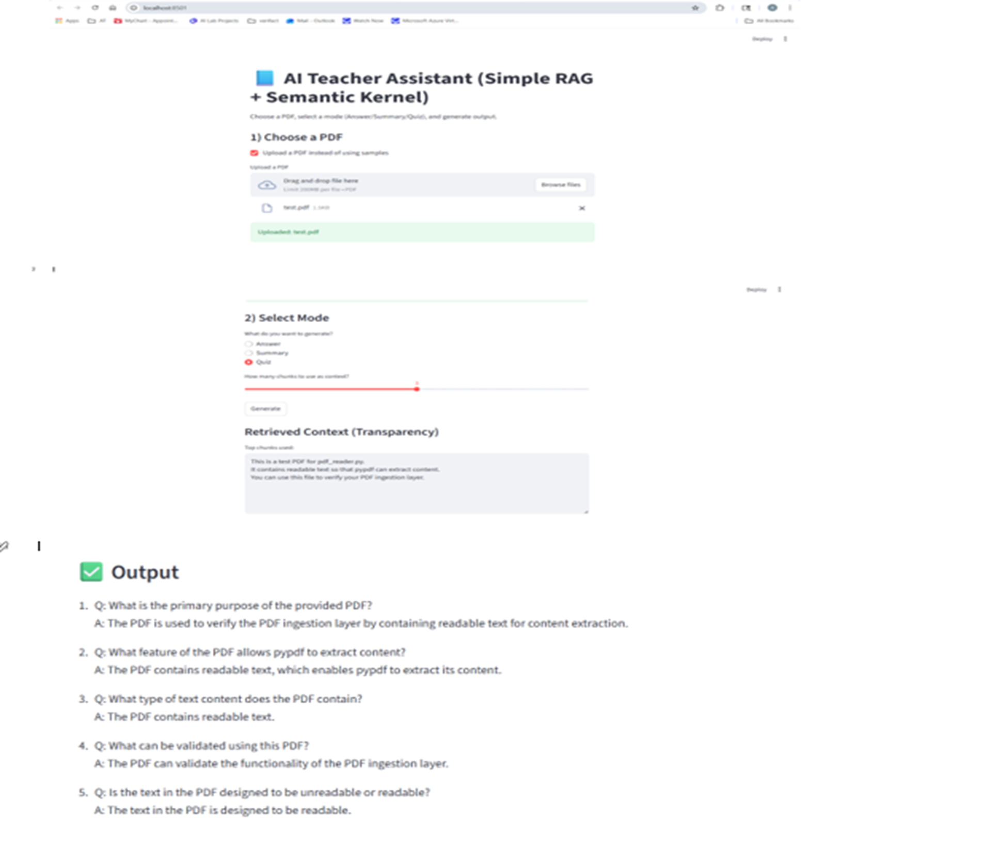

STEP 10 — What to write in README.md (important for recruiters)
Include these sections:
## Project 2: AI Teacher Assistant
### Problem
Students struggle to extract answers from long PDFs.
### Solution
An AI-powered assistant that:
- Reads PDFs
- Retrieves relevant content
- Uses Semantic Kernel to generate answers
### Architecture
UI (Streamlit) → RAG Logic → Semantic Kernel → OpenAI

### Tech Stack
- Python
- Streamlit
- Semantic Kernel
- OpenAI GPT-4o-mini
### Key Learnings
- Semantic Kernel orchestration
- Prompt-based RAG without vector DB
- Modular AI architecture
### How to Run
pip install -r requirements.txt
streamlit run app.py
### Environment Variables
OPENAI_API_KEY=your_key_here
OPENAI_MODEL=gpt-4o-mini
### Features
Answer questions from PDF context
Summarize PDF content for students
Generate quiz questions with answers
## Demo Screenshot

