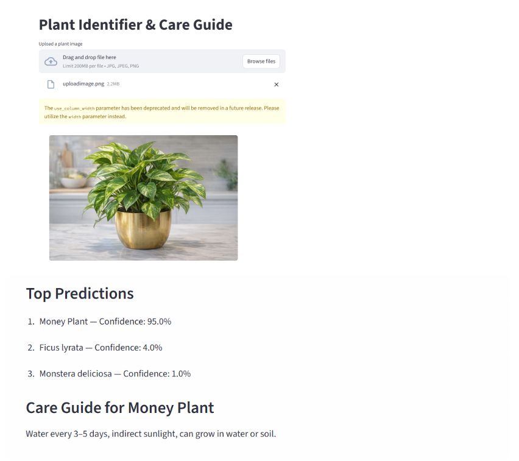

# 🌿 Project 3 — Plant Identification Agent (PlantPal)

This project is part of **Phase 2** of my AI Engineering Portfolio.

---
## 📸 Demo


---
## 🔎 Overview

PlantPal is a modular AI-ready houseplant identification assistant built using Streamlit.

This MVP demonstrates a complete AI workflow architecture:

- Image upload handling
- Prediction pipeline integration (`identify_plant()` service layer)
- Confidence score display
- Structured care instruction lookup from JSON
- Graceful fallback handling
- Clean modular separation (UI → Services → Data)

The focus of this version is **pipeline architecture and integration design**, preparing the system for real vision model integration.

---
## 🎯 MVP Capabilities

- Upload plant image
- Run prediction through a modular service layer (local PyTorch model)
- Display predicted plant name with confidence score
- Retrieve plant care instructions from structured JSON database
- Manual plant selection via dropdown
- Error handling when predicted plant is not in care database

---
## ⚠️ Known Limitations

-Current offline model is trained on a limited set of houseplants
-Predictions may not cover all species
-Care guide defaults to generic plant care when species is unknown

## 🛠 Tech Stack

-Python
-PyTorch (offline model)
-Streamlit (UI Layer)
-JSON-based structured plant database
-Modular architecture (UI → Services → Data)
-Git-based version control

---
## 🤖 AI Integration
-The prediction pipeline uses a local PyTorch model for image classification.
-Fully offline — no API tokens required
-Easy replacement of model without changing the UI layer
-Predictions output top-3 confidence scores

## 🧠 Architecture Design

User Upload → Streamlit UI → identify_plant() →
Prediction Output → Care Lookup (JSON) → Display Results

This separation ensures:

-Clean scalability
-Easy model replacement
-Future AI model upgrades without UI changes
---
## 🚧 Current Status

✅ MVP Complete

⚠️ Prediction component uses a limited offline model, which may not accurately identify all houseplant species.
🚀 Expansion of local plant database planned for improved coverage.

---
## 🚀 Upcoming Enhancements (Next Iteration)

-Expand local plant care database
-Map scientific names to common plant names
-Improve prediction accuracy and coverage
-Add top-3 prediction output formatting
-Deploy web-hosted version

---
## 📂 Folder Structure

```text
project_3_plant_identification
├── app/                         # Streamlit UI
├── services/                    # Prediction logic
│   ├── image_identifier_v1.py   # Mock logic
│   └── local_image_identifier.py # Offline PyTorch model integration
├── src/                         # Care data handling
├── data/                        # JSON plant database
├── assets/                      # Images and diagrams
│   ├── identify_plant_locally.png # Demo images
│   └── architecture.png         # System architecture diagram
├── requirements.txt
└── README.md
```

### 🧠 System Architecture


## 🔄 Version Evolution

**v1 — MVP Architecture**

-Randomized placeholder prediction logic
-Focus on UI → Service → Data pipeline
-JSON-based care database integration


**v2 — Offline Local Model Upgrade**

-Integrated local PyTorch image classification model
-Real image-based prediction locally
-Confidence score and top-3 predictions
-Works without API tokens or external services

## 💡 Learning Outcome

This project focuses on building production-style AI architecture before optimizing model accuracy.

The goal is to design systems that are:
- Modular
- Scalable
- Replaceable
- Integration-ready

Model accuracy improvements are planned in the next version.