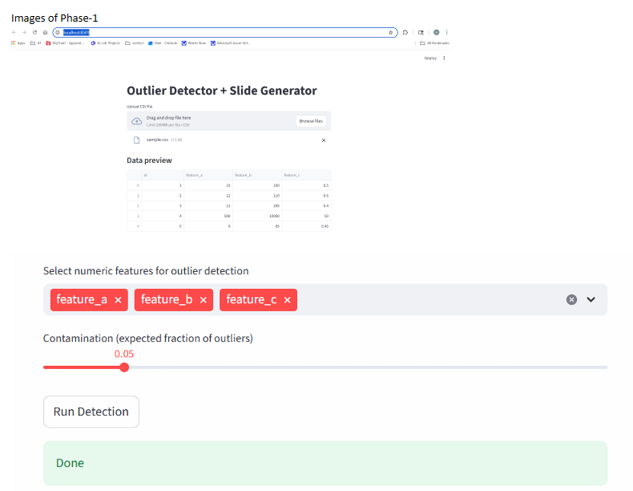
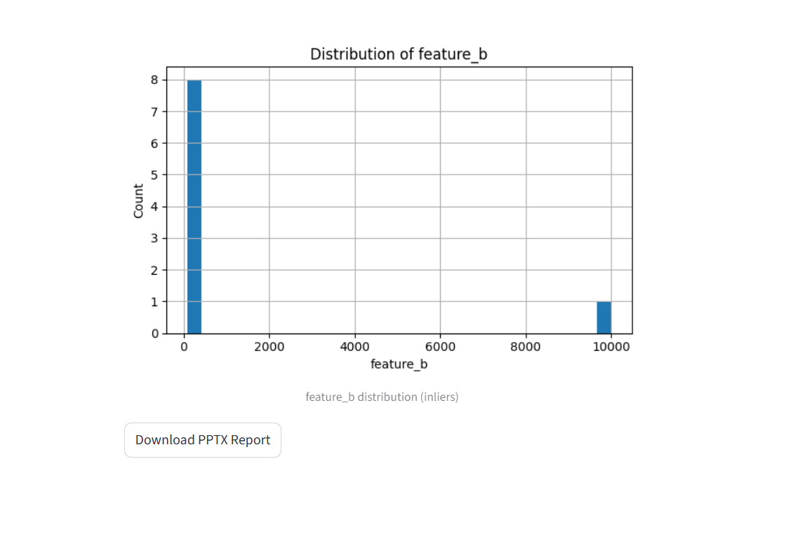
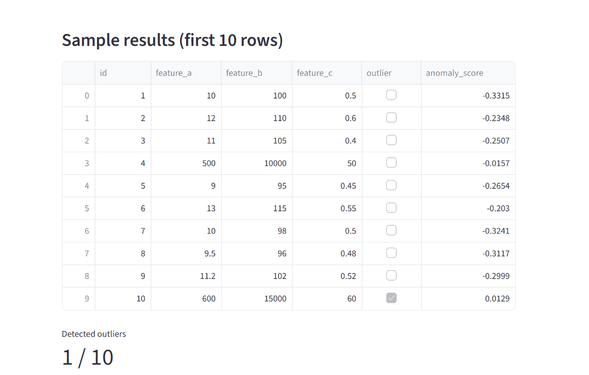

# 📊 Project 1 — Outlier Detector + AI Slide Generator

## 🎯 Goal

To help educators quickly understand student performance by detecting outliers in assessment datasets and automatically generating instructional slides enhanced with Generative AI.

This project combines classical data analytics with LLM-powered content creation — tailored for scalable educational workflows.

---

## 🚀 Features

✔ Detects statistical outliers from student performance data
✔ Visualizes results with clear summary insights
✔ Generates a complete slide deck using AI (topic + level + language configurable)
✔ Optional images generated using a multimodal AI model
✔ Ready for educators and EdTech tools

---

## 🧠 How It Works

```mermaid
flowchart TD
A[CSV Data Upload] --> B[Outlier Detection Logic (Python/Pandas)]
B --> C[Summary Insights & Metrics]
C --> D[LLM Prompt Generation]
D --> E[Slide Content & Structure Created]
E --> F[Slide Rendering with Images]
F --> G[Downloadable PPTX Output]
```

---

## 🛠️ Tech Stack

| Area            | Tools                                   |
| --------------- | --------------------------------------- |
| Programming     | Python                                  |
| Data Processing | Pandas                                  |
| ML/Stat Models  | Statsmodels (Outlier Detection)         |
| Generative AI   | Gemini / Imagen (Google AI Models)      |
| UI (Future)     | Streamlit                               |
| Storage         | Local / Cloud (optional Firebase + GCS) |

---

## 📂 Folder Structure

```plaintext
project_1_outlier_slide_gen/
│
├─ app.py                 # Main application
├─ slide_gen.py           # AI slide generation logic
├─ utils.py               # Data processing utilities
├─ model.py               # Outlier detection pipeline
├─ data/                  # Sample datasets
├─ outputs/               # Generated PPTX + visuals
├─ screenshots/           # Preview results
└─ README.md              # You are here!
```

---

## 📌 Outlier Detection Example

| Metric  | Value                                 |
| ------- | ------------------------------------- |
| Dataset | Student scores (CSV)                  |
| Method  | Z-Score statistical threshold         |
| Output  | Flagged student performance anomalies |

---

## 🧪 Sample Output





---

## ▶️ Run the App Locally

### 1️⃣ Clone Repo

```bash
git clone https://github.com/your-username/ai-portfolio.git
cd ai-portfolio/phase_1/project_1_outlier_slide_gen
```

### 2️⃣ Install Dependencies

```bash
pip install -r requirements.txt
```

### 3️⃣ Run the App (UI pending)

```bash
python app.py
```

---

## 🔍 Future Enhancements

* Interactive Streamlit UI
* Support for multiple outlier algorithms
* Cloud hosting for live demo
* Automated evaluation of slide explanations

---

## 🎓 Why This Project Matters

This solution empowers educators to:

* Save time in analyzing student performance
* Receive AI-generated teaching aids instantly
* Improve feedback quality and personalization

Helping make learning **more accessible and data-driven**.

---

## 👩‍💻 Author

**Aiyesha Talat**
AI Engineer — Microsoft Certified (AI-102)
Focused on practical AI for education & accessibility

📌 LinkedIn: https://www.linkedin.com/in/aiyesha-ai-engineer/
📌 Email: aiyeshat@yahoo.com

---

### ⭐ If you found this interesting — please ⭐ star the repo!

---


