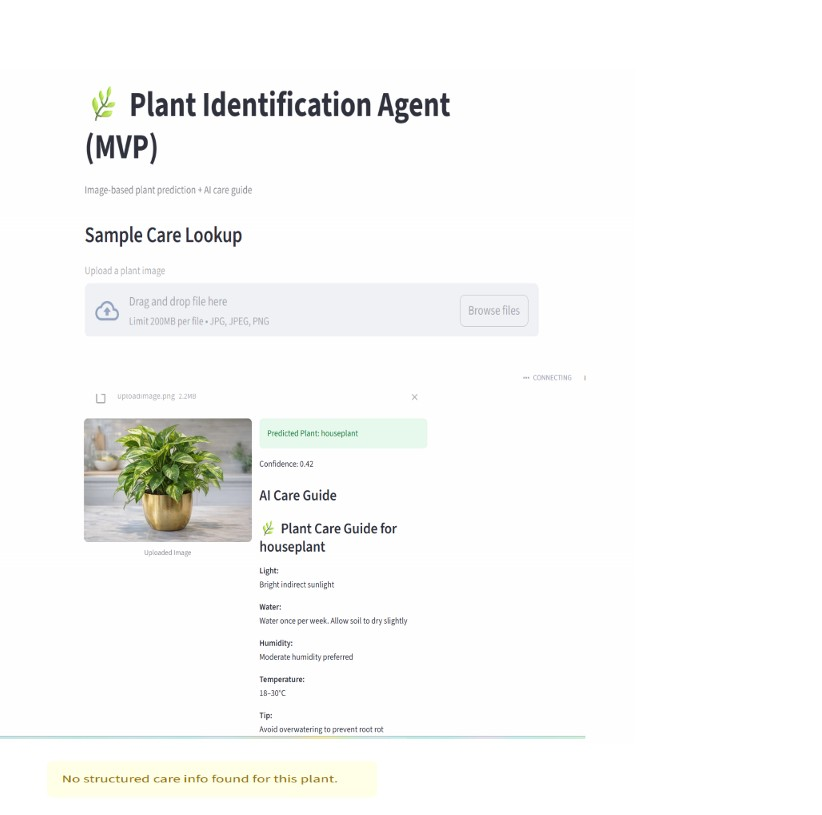
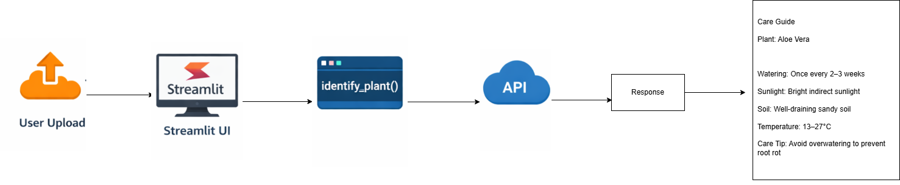

# 🌿 Project 3 — Plant Identification Agent (PlantPal)

This project is part of **Phase 2** of my AI Engineering Portfolio.

---
## 📸 Demo


---
## 🔎 Overview

PlantPal is a modular AI-ready houseplant identification assistant built using Streamlit.

This MVP demonstrates a complete AI workflow architecture:

- Image upload handling
- Prediction pipeline integration (`identify_plant()` service layer)
- Confidence score display
- Structured care instruction lookup from JSON
- Graceful fallback handling
- Clean modular separation (UI → Services → Data)

The focus of this version is **pipeline architecture and integration design**, preparing the system for real vision model integration.

---
## 🎯 MVP Capabilities

- Upload plant image
- Run prediction through a modular service layer
- Display predicted plant name with confidence score
- Retrieve plant care instructions from structured JSON database
- Manual plant selection via dropdown
- Error handling when predicted plant is not in care database

---
## ⚠️ Known Limitations

- Current model is not specialized for houseplant species
- Predictions may return generic labels (e.g., "houseplant")
- Care guide defaults to generic plant care when species is unknown

## 🛠 Tech Stack

- Python
- Streamlit (UI Layer)
- JSON-based structured plant database
- Modular architecture (UI → Services → Data)
- Environment-secured API configuration
- Git-based version control

---
## 🤖 AI Integration

The prediction pipeline is designed to support real AI models.

Current integration:
- Hugging Face Inference API
- Image classification model for plant identification

The service layer (`identify_plant`) allows easy replacement of models without changing the UI layer.

Note: The current model is a general-purpose classifier and may return 
broad or non-specific labels (e.g., "houseplant" or plant conditions).

## 🧠 Architecture Design

User Upload → Streamlit UI → identify_plant() →
Prediction Output → Care Lookup (JSON) → Display Results

This separation ensures:
- Clean scalability
- Easy model replacement
- Future AI model integration without UI changes

---
## 🚧 Current Status

✅ MVP Complete  
⚠️ Prediction component uses a general image classification model, which may not  accurately identify specific houseplant species 
🚀 Vision-based plant classifier integration planned

---
## 🚀 Upcoming Enhancements (Next Iteration)

- Integrate pretrained plant image classification model
- Map scientific names to common plant names
- Improve prediction accuracy
- Add top-3 prediction output
- Expand local plant care database
- Deploy web-hosted version

---
## 📂 Folder Structure

```text
project_3_plant_identification
├── app/                         # Streamlit UI
├── services/                    # Prediction logic
│   ├── image_identifier_v1.py   # Mock logic
│   └── image_identifier_v2.py   # Vision API integration
├── src/                         # Care data handling
├── data/                        # JSON plant database
├── assets/                      # Images and diagrams
│   ├── demo_v2/                 # Demo images
│   └── architecture.png         # System architecture diagram
├── requirements.txt
└── README.md
```

### 🧠 System Architecture


## 🔄 Version Evolution

**v1 — MVP Architecture**
- Randomized placeholder prediction logic
- Focus on UI → Service → Data pipeline
- JSON-based care database integration

**v2 — Vision Model Upgrade**
- Integrated Hugging Face plant classification API
- Real image-based prediction using Hugging Face API (general classifier)
- Confidence score returned from model inference

## 💡 Learning Outcome

This project focuses on building production-style AI architecture before optimizing model accuracy.

The goal is to design systems that are:
- Modular
- Scalable
- Replaceable
- Integration-ready

Model accuracy improvements are planned in the next version.