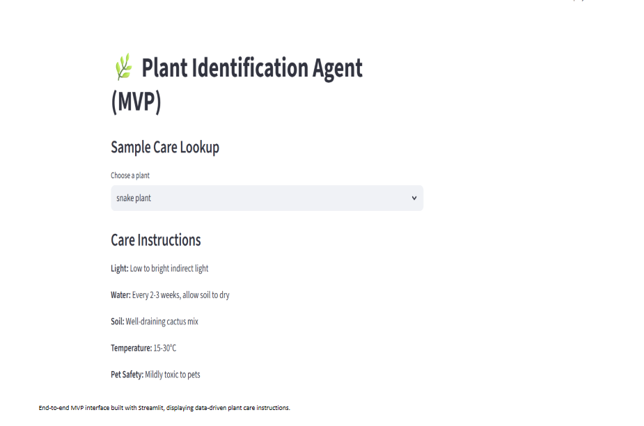

# 🌿 Project 3 — Plant Identification Agent (MVP)

This project is part of Phase 2 of my AI Portfolio.

---

## 📸 Demo


---

## 🔎 Overview
PlantPal is a houseplant identification assistant designed with a modular AI-ready architecture.

The current MVP version uses structured JSON data with a Streamlit UI to demonstrate prediction flow and care instruction delivery. Vision API integration for image-based plant recognition is planned for the next phase.

---

## 🎯 Goals
- Upload plant image
- Predict plant name
- Provide watering, sunlight, and soil guidance
- Build modular AI pipeline

---

## 🛠 Tech Stack
- Python
- Streamlit (UI)
- JSON-based structured data
- Modular Architecture (UI → Logic → Data)
- Environment-secured API keys

---

## 🚧 Current Status
🛠 MVP Built (Vision API integration pending)

---

## 🚀 Next Phase (Upcoming Enhancements)

- Image upload interface  
- AI-powered image upload identification  
- Displays predicted plant with confidence score  
- Automatically generates care instructions  
- Top-3 prediction output  
- Vision API integration  
- Local fallback plant database  
- Deployable web app version  

---

## 🗂 Folder Structure

```text
project_3_plant_identification/
├── app/
├── assets/
├── data/
├── src/
├── requirements.txt
└── README.md
